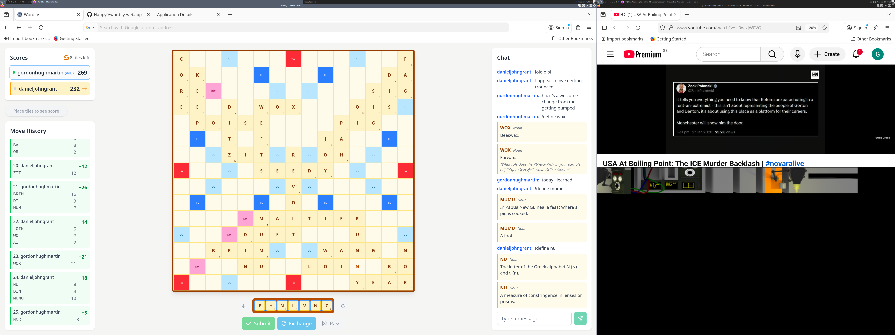

# Wordify



A side project for me to learn stuff with but contributions welcome ':D.

# Development

## Haskell Setup

1. If you haven't already, [install Stack](https://haskell-lang.org/get-started)
	* On POSIX systems, this is usually `curl -sSL https://get.haskellstack.org/ | sh`
2. Install the `yesod` command line tool: `stack install yesod-bin --install-ghc`
3. Build libraries: `stack build`

If you have trouble, refer to the [Yesod Quickstart guide](https://www.yesodweb.com/page/quickstart) for additional detail.

## UI Setup

There are some frontend components written in Vue in the ui folder. [NPM](https://docs.npmjs.com/downloading-and-installing-node-js-and-npm) is required to build them.

Running the ./build-ui.sh script will build these components and copy the build artefacts to the 'static' folder to be picked up by the Yesod app and serve them.

## Development

### OIDC

The app requires OAuth2 for login. This has only been tested with Auth0. The following 3 environment variables are used to configure the OAuth2 flow:

AUTH_CLIENT_ID - corresponds to the 'Client ID' in the Auth0 app.

AUTH_CLIENT_SECRET - corresponds to the 'Client Secret' in the Auth0 app.

AUTH_BASE_URI - corresponds to the 'Domain' parameter in the Auth0 app with https:// added at the front

Note: http://127.0.0.1:3000/auth/page/oauth0/callback should be added to the 'Allowed Callback URLs'

### Running the App

Build the UI components using the 'UI Setup' step above

Start a development server with:

```
export AUTH_CLIENT_ID=...
export AUTH_CLIENT_SECRET=...
export AUTH_BASE_URI=...
stack exec -- yesod devel
```

As your code changes, your site will be automatically recompiled and redeployed to localhost.

Alternatively, run a server without automatic recompilation with:

```
export AUTH_CLIENT_ID=...
export AUTH_CLIENT_SECRET=...
export AUTH_BASE_URI=...
stack run
```

The `YESOD_SQLITE_DATABASE` environment variable can be used to override the path of the SQLite database (defaults to `wordify-webapp.sqlite3` in the folder the app is ran in.)

The app will run at http://127.0.0.1:3000 . There is no need to restart the app when the UI is updated and built via the 'build-ui.sh' script.

# Deployment

(Assumes familiarity with docker.)

There is a Dockerfile that can be used to build and run the app in docker. The environment variables above should be passed to the running container. The app will run on port 8080 inside the container.